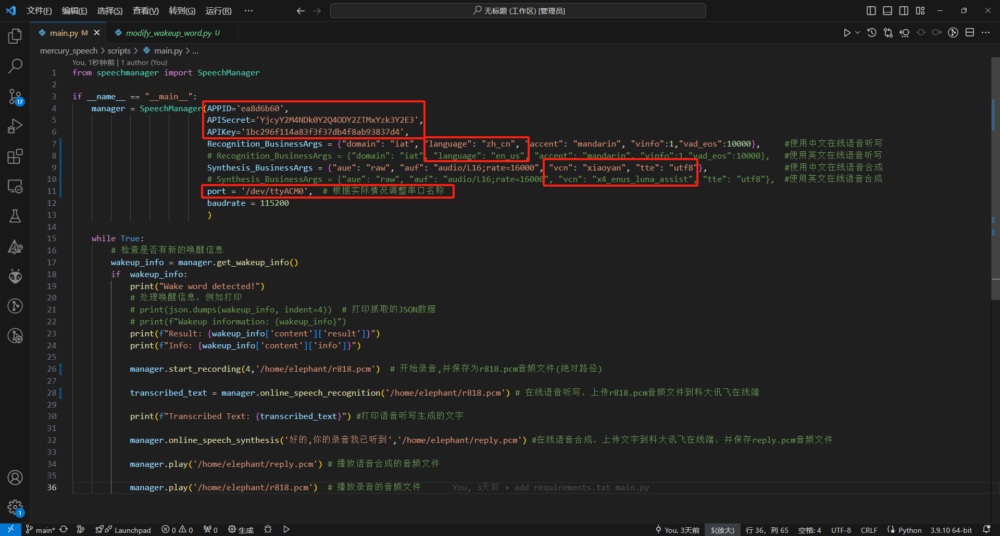
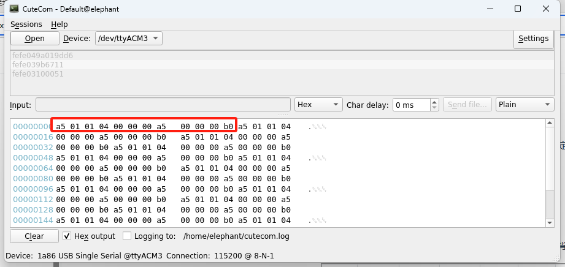
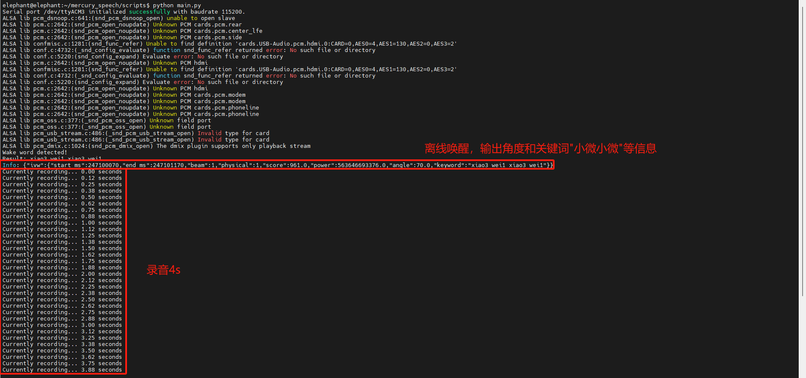
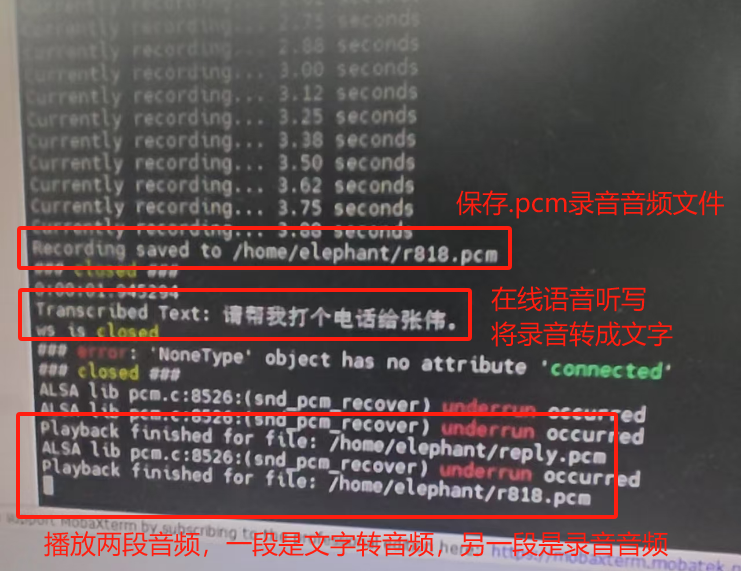

# 代码流程

离线唤醒——>录音——>在线语音听写——>在线语音合成——>播放音频

代码运行流程：运行python脚本后，说出唤醒词（小微小微），听到唤醒词后开始录音（默认4s），生成.pcm的音频文件，然后将录音文件上传到科大讯飞在线端，并获取语音听写输出的文字。同时也将对话的文字上传到科大讯飞在线端，合成对话音频并播放出来。

在线语音听写和在线语音合成功能服务需要自行申请。

# 科大讯飞应用申请

```
https://www.xfyun.cn/
```

登录讯飞开放平台，注册和登录用户，并且实名认证


1.主页面找到控制台，点击进去


2.在左上角，找到创建新应用


3.根据需求填写应用名称，应用分类和功能描述，并提交


4.返回到我的应用，点击刚刚创建的应用


5.找到在线语音听写功能，右上角就是该应用的授权信息。

需要注意的是：应用创建时为体验版（免费），应用部分功能的服务量有效期可能为30天或者90天不等，如果服务量需求较多可以额外购买套餐。

```
https://www.xfyun.cn/services/voicedictation
```


6.在线语音合成申请英文发音人授权，同样的申请的语音合成也为体验版，如果服务量需求较多可以额外购买套餐。

```
https://www.xfyun.cn/services/online_tts
```


7.需要获取APPID，APISecret，APIKey，中英文参数，语音合成音频参数

```
SpeechManager 类用于管理语音相关的功能，包括语音唤醒、在线语音识别、在线语音合成、录音和播放 PCM 文件。

参数:
- APPID: 应用的 APPID,用于 API 调用。
- APISecret: API 秘钥，用于身份验证。
- APIKey: API 密钥，用于 API 授权。
- Recognition_BusinessArgs: 在线语音识别的业务参数，用于指定识别的行为。
- Synthesis_BusinessArgs: 在线语音合成的业务参数，用于指定合成的行为。
- port: 串口端口号 (默认值为 '/dev/ttyACM0')，用于离线唤醒功能。
- baudrate: 串口的波特率 (默认值为 115200)，用于离线唤醒的串口通信。
```



# 环境搭建

1.拉取代码

```
git clone https://github.com/elephantrobotics/mercury_speech.git
```

2.终端输入下面指令，安装依赖的文件

```
sudo apt-get install portaudio19-dev python3-dev
```

```
cd ~/mercury_speech/
pip install -r requirement.txt
```

# 代码示例

1.检测一下哪个是语音模块串口

终端输入cutecom，打开串口助手，查看ttyACM*的串口设备

语音模块会500ms固定发出“a5 01 01 04 00 00 00 a5 00 00 00 b0”的握手请求。



2.修改main.py文件终端port串口并保存

3.终端输入python main.py运行

```python
from speechmanager import SpeechManager

if __name__ == "__main__":
    manager = SpeechManager(APPID='ea8d6b60', 
                            APISecret='YjcyY2M4NDk0Y2Q4ODY2ZTMxYzk3Y2E3',
                            APIKey='1bc296f114a83f3f37db4f8ab93837d4',
                            Recognition_BusinessArgs = {"domain": "iat", "language": "zh_cn", "accent": "mandarin", "vinfo":1,"vad_eos":10000},     #使用中文在线语音听写
                            # Recognition_BusinessArgs = {"domain": "iat", "language": "en_us", "accent": "mandarin", "vinfo":1,"vad_eos":10000},   #使用英文在线语音听写
                            Synthesis_BusinessArgs = {"aue": "raw", "auf": "audio/L16;rate=16000", "vcn": "xiaoyan", "tte": "utf8"},                #使用中文在线语音合成
                            # Synthesis_BusinessArgs = {"aue": "raw", "auf": "audio/L16;rate=16000", "vcn": "x4_enus_luna_assist", "tte": "utf8"},  #使用英文在线语音合成
                            port = '/dev/ttyACM3',  # 根据实际情况调整串口名称
                            baudrate = 115200
                            )

    while True:
        # 检查是否有新的唤醒信息
        wakeup_info = manager.get_wakeup_info()
        if  wakeup_info:
            print("Wake word detected!")
            # 处理唤醒信息，例如打印
            # print(json.dumps(wakeup_info, indent=4))  # 打印抓取的JSON数据
            # print(f"Wakeup information: {wakeup_info}")
            print(f"Result: {wakeup_info['content']['result']}")
            print(f"Info: {wakeup_info['content']['info']}")

            manager.start_recording(4,'/home/elephant/r818.pcm')  # 开始录音4s,并保存为r818.pcm音频文件(绝对路径)

            transcribed_text = manager.online_speech_recognition('/home/elephant/r818.pcm') # 在线语音听写，上传r818.pcm音频文件到科大讯飞在线端

            print(f"Transcribed Text: {transcribed_text}") #打印语音听写生成的文字
            
            manager.online_speech_synthesis('好的,你的录音我已听到','/home/elephant/reply.pcm') #在线语音合成，上传文字到科大讯飞在线端，并保存reply.pcm音频文件
            
            manager.play('/home/elephant/reply.pcm') # 播放语音合成的音频文件

            manager.play('/home/elephant/r818.pcm')  # 播放录音的音频文件
```


# 运行效果





# 功能接口描述

`online_speech_recognition(AudioFile)`

-  在线语音识别

​    param AudioFile: 录音文件路径

​    return: 识别后的文本

`online_speech_synthesis(Text,pcm_file)`

- 在线语音合成

​    param Text: 待合成的文本

​    param pcm_file: 合成后保存的文件名

`play(filename)`

- 播放指定的 PCM 文件

  param filename: PCM 文件路径

`start_recording(TIME, pcm_file)`

- 设置录音参数并验证输入的录音时长

​    param TIME: 录音时长，单位为秒，必须在 0 到 60 秒之间 (默认值为 4 秒)

​    param pcm_file: 保存录音的文件名 (默认文件名为 'r818.pcm')

`get_wakeup_info()`

- 获取唤醒的信息，如果有新数据，则返回唤醒信息，并重置事件状态。

​    return: 返回唤醒信息

